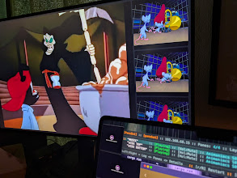

#  PaneBot NodeOS
<br>
Reference hardware and OS configuration for a dedicated PaneBot display target.

A PaneBot node is a machine running `panebot-daemon` in remote mode — no keyboard, no mouse, no desktop. It boots into a minimal Hyprland session, the daemon starts automatically, panes open into a tiling layout, and the display is ready to receive streams from any connected controller on the network.

This is the reference deployment. The daemon itself runs on any platform — see [panebot](https://github.com/marlovious/panebot) for local installation on macOS or Linux. This repo is specifically for building and maintaining dedicated display hardware.

---

## What It Is

A node is minimal by design. The OS exists to run mpv. Hyprland manages window placement. The daemon manages mpv and serves the WebSocket API. Nothing else runs.

```
[boot]
  └── uwsm → Hyprland session
        └── systemd user service → panebot-daemon
              └── spawns mpv per pane into tiling layout
              └── listens on wss://0.0.0.0:9090
```

Any PaneBot controller — the TUI, the browser extension, or any client speaking the protocol — connects over the LAN and has full control. The node never needs to be touched again after initial setup.

---

## Reference Hardware

Any x86 machine with a GPU and HDMI out works. The reference build uses a MinisForum mini PC — low power, silent, fits behind a display, drives 4K without issue.

**Minimum:**
- x86_64 CPU
- Dedicated or integrated GPU with hardware decode
- HDMI / DisplayPort output
- 8GB RAM
- 64GB storage

---

## OS

**Debian testing + Hyprland + uwsm**

Debian testing gives you a current kernel and mesa without the instability of Arch. Hyprland provides tiling window management with named window rules — panes spawn into known positions without any user interaction. `uwsm` runs the graphical session as a systemd user service, which means `panebot-daemon` can declare a dependency on the session and start cleanly at login.

No display manager. No desktop environment. No browser. Auto-login via getty.

---

## Installation

### 1. Install Debian testing

Standard netinstall. No desktop environment. Create a user — this user will run the session and the daemon.

Ensure the node has a working network connection and a static or reserved IP on the same LAN as your PaneBot controller before proceeding.

### 2. Install dependencies

```bash
sudo apt install -y \
  hyprland uwsm mpv \
  build-essential pkg-config libssl-dev
```

Install Rust:

```bash
curl --proto '=https' --tlsv1.2 -sSf https://sh.rustup.rs | sh
```

### 3. Build and install the daemon

```bash
git clone https://github.com/marlovious/panebot
cd panebot
cargo install --path panebot-daemon
```

### 4. Configure auto-login

```bash
sudo systemctl edit --force getty@tty1.service
```

Add:

```ini
[Service]
ExecStart=
ExecStart=-/sbin/agetty --autologin USERNAME --noclear %I $TERM
```

### 5. Start Hyprland on login

Add to `~/.bash_profile`:

```bash
if [ -z "$DISPLAY" ] && [ "$(tty)" = "/dev/tty1" ]; then
    exec uwsm start hyprland.desktop
fi
```

### 6. First run — bootstrap config

```bash
panebot-daemon
```

This creates `~/.config/panebot/` with default pane configs, layout files, and a self-signed TLS certificate. Stop the daemon (`Ctrl-C`) and edit the config before installing as a service.

### 7. Configure panes

Edit `~/.config/panebot/pb.panes.conf` to define your panes. See [panebot](https://github.com/marlovious/panebot) for the full config reference.

Set the daemon to remote mode in `~/.config/panebot/pb.daemon.conf`:

```ini
mode = remote
```

### 8. Configure Hyprland window rules

Source the generated rules file from `hyprland.conf`:

```bash
echo "source = ~/.config/panebot/pb.hypr.conf" >> ~/.config/hypr/hyprland.conf
```

Geometry values in layout files are not used on Linux — Hyprland controls window placement via these rules. Edit `pb.hypr.conf` to match your screen layout.

### 9. Install as a systemd user service

```bash
mkdir -p ~/.config/systemd/user

cat > ~/.config/systemd/user/panebot-daemon.service << 'EOF'
[Unit]
Description=PaneBot Daemon
After=graphical-session.target

[Service]
ExecStart=%h/.cargo/bin/panebot-daemon
Restart=on-failure
RestartSec=2

[Install]
WantedBy=default.target
EOF

systemctl --user daemon-reload
systemctl --user enable panebot-daemon
```

### 10. Reboot

```bash
sudo reboot
```

The machine boots, logs in automatically, starts Hyprland, the daemon starts with the session, panes open, the display is ready.

---

## Connecting

Add the node to `pb.daemon.conf` on your controller machine so it appears in the TUI's known hosts list:

```ini
[my-node]
address = wss://192.168.1.x:9090
```

Then connect from the TUI:

```bash
panebot-tui
```

Press `C` to select the node from the list. `panebot-tui` receives the snapshot and shows all panes.

For the browser extension, the node's certificate needs to be trusted in the browser before it can connect. Either navigate to `https://nodeip:9090` directly and accept the certificate, or click the trust prompt from within the extension's connection UI. One-time setup per browser.

---

See [panebot](https://github.com/marlovious/panebot) for the full config and directory reference.

---

## Logs

```bash
journalctl --user -u panebot-daemon -f
journalctl --user -u panebot-daemon --since "1 hour ago"
cat ~/.config/panebot/panebot-daemon.log
```

---

## Requirements

- Debian testing (or any systemd Linux)
- Hyprland
- uwsm
- mpv
- Rust (build only)

---

## License

MIT
